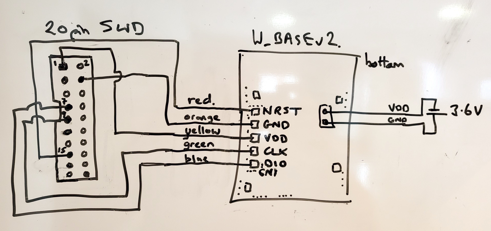
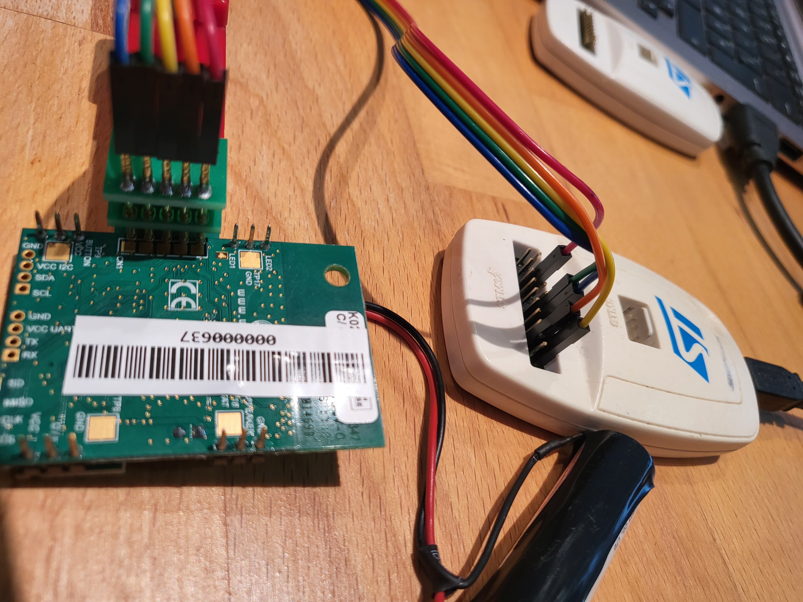
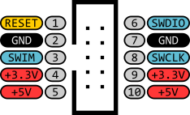

# Wyres Base

Card revisions
 - v2 revB (SX1272, RF switch old)
 - v2 revC/D (SX1272, RF switch Skynet new)) 
 - v3 revA/B (SX1261/2)

Card hardware:
 - STM32L151CC MCU
 - 256kb flash / 32kb RAM / 8kb EEPROM : MCU based 
 - UART(1) : MCU based : external grove connector
 - SPI(2) : MCU based : 1 dedicated for radio, 1 on header
 - I2C(1) : MCU based : external grove connector
 - Accelero : ST LIS2DE12 via I2C https://github.com/RIOT-OS/RIOT/tree/master/tests/driver_lis2dh12
 - Altimeter : ST LPS22HB via I2C https://github.com/RIOT-OS/RIOT/tree/master/tests/driver_lpsxxx
 - light sensitive trans. on GPIO
 - MEMS microphone on I2S bus
 - Semtech Lora radio SX1272 on SPI bus
 - 2 LEDs via GPIO on-board and via header
 - 1 'power' PWM GPIO (mosfet switched) on header
 - 1 'button' GPIO input with limiter resistance on header
 - 1 GPIO on header


## Source code

Apache MynewT implementation : https://github.com/wyres/mynewt-wbasev2-bsp


## Flashing with STLink Nucleo SWD

Connect the board's pins to the STLink flasher

| STLink Nucleo SWD                        | Color  | Wyres Base  |
|------------------------------------------|--------|-------------|
| Pin 1: VDD_TARGET (VDD from application) | Red    | Pin 3: VDD  |
| Pin 2: SWCLK (clock)                     | Yellow | Pin 4: CLK  |
| Pin 3: GND (ground)                      | Black  | Pin 2: GND  |
| Pin 4: SWDIO (SWD data input/output)     | Blue   | Pin 5: DIO  |
| Pin 5: NRST (RESET of target STM32)      | Green  | Pin 1: NRST |






## Flashing with Chinese STLink Clone Programmer

| STLink Clone SWD                         | Color  | Wyres Base  |
|------------------------------------------|--------|-------------|
| Pin 9: VDD_TARGET (VDD from application) | Red    | Pin 3: VDD  |
| Pin 8: SWCLK (clock)                     | Yellow | Pin 4: CLK  |
| Pin 7: GND (ground)                      | Black  | Pin 2: GND  |
| Pin 6: SWDIO (SWD data input/output)     | Blue   | Pin 5: DIO  |
| Pin 1: NRST (RESET of target STM32)      | Green  | Pin 1: NRST |




## Pinout

https://github.com/wyres/mynewt-wbasev2-bsp/blob/master/w_base/include/bsp/bsp_defs.h


## Requirements for flashing and debugging
* STLink v2 programmer
* FTDI (USB Serial adapter)
* [PCB Clamp 2.54 mm Single Row 5 pins](https://fr.aliexpress.com/item/1005001409579446.html)

## Build Apache MyNewT-based firmwares

### With Docker
#### Setup
```bash
mkdir -p ~/github/wyres
git clone git@github.com:wyres/mynewt_app_iocontrol.git ~/github/wyres/mynewt_app_iocontrol
cp newt.sh hex_maker.sh ~/github/wyres/mynewt_app_iocontrol

cd  ~/github/wyres
cd mynewt_app_iocontrol
chmod +x *.sh
./newt.sh version
./newt.sh help
```

Uncomment `repo: mynewt-core` in `project.yml`

```bash
./newt.sh upgrade
```

> NB: Project dependaencies are downloaded into the directory [./repos](./repos)

### Build

Choose one target:

```bash
for t in targets/*; do echo $t; grep pkg.description $t/pkg.yml; done
```

```
targets/wbasev2_bootloader
pkg.description: WBase V2 based bootloader target
targets/wbasev2_io_eu868_ipev_dev
pkg.description: WBasev2 based target for EU868 with external sensors on gpio for IPEV
targets/wbasev2_io_eu868_none_dev
pkg.description: WBasev2 based target for EU868 with external sensors on gpio
targets/wbasev2_io_eu868_river_dev
pkg.description: WBasev2 based target for EU868 with external sensors on gpio
targets/wbasev2_io_eu868_river_prod
pkg.description: WBasev2 based target for EU868 with external sensors on gpio
targets/wproto_bootloader
pkg.description: wProto based bootloader target
targets/wproto_io_eu868_heating_dev
pkg.description: WProto based target for EU868 with external control for heating
targets/wproto_io_eu868_none_dev
pkg.description: WProto based target for EU868 with external sensors on gpio
```

```bash
TARGET=wbasev2_io_eu868_river_dev
./hex_maker.sh $TARGET
```

Work in progress ...
```
Building target wbasev2_io_eu868_river_dev : starting
WARNING: apache-mynewt-core: Repo version missing from compatibility map
* Warning: Failure parsing "/workspace/repos/lorawan/lorawan_wrapper/syscfg.yml": [:20]: mapping values are not allowed in this context; ignoring package /workspace/repos/lorawan/lorawan_wrapper.
Building target targets/wbasev2_io_eu868_river_dev
Error: Could not resolve package dependency: @lorawan/lorawan_wrapper; depender: loraapi_KLK
```

## Flash


## Console

Open the serial console of the board (Groove UART connector to USB serial adapter)
```bash
brew install tio
tio -L
tio -b 115200 -m INLCRNL /dev/tty.usbserial-142xxx
```

or
```bash
make term
```

or
```bash
minicom -s
```

## Build with RIOT OS (Work in Progress)

### Getting started

```bash
cd ~/github/RIOT-OS/RIOT
cd examples/hello-world
EXTERNAL_BOARD_DIRS=~/github/campusiot/RIOT-wyres/boards make BOARD=nucleo-l151cc
```

## Dataviz with Grafana
[Chirpstack v3 decoder](chirpstack3-decoder.js)

[Dashboard](wyres-base.json)


