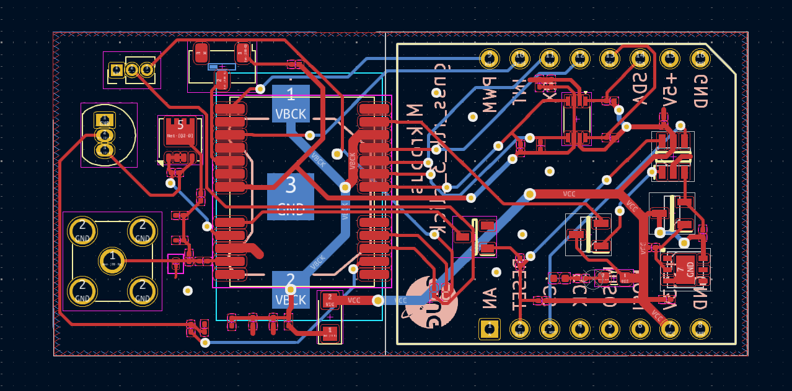

# Mikrobus click for Quectel LC29H GNSS RTK modules

Designed by Jihane ZEMMOURA with [KiCad EDA](https://www.kicad.org/)

This Mikrobus module is a simplified variant to the [GNSS RTK 3 Click (MIKROE-5914)](https://www.mikroe.com/gnss-rtk-3-click) ([schematic](../../doc/gnss_rtk_3_click/GNSS_RTK_3_Click_v100_Schematic.PDF)).

Its design respects the [Mikrobus form factor](https://download.mikroe.com/documents/standards/mikrobus/mikrobus-standard-specification-v200.pdf). But it is only for 3.3V MCU (ie there is no [level shifter](https://www.ti.com/lit/ds/symlink/txs0108e.pdf?ts=1719798042989)). LED are enabled by zero ohm resistors for low-power considerations. The identifier crypto chip ([DS28E36BQ](https://www.maximintegrated.com/en/products/embedded-security/secure-authenticators/DS28C36.html/storefront/my-quotes.html)) is optional.

Thanks to Quectel for supporting us:
* 17 LC29HEAMD (rover)
* 8 LC29HBSAMD (base)
* 25 YG0063AA (antennas) + 3m cable TNC-K (F) to SMA(M) , RG174 cable

[Schematic](schematic.pdf)

Configuration tool QGNSS https://market.quectel.com/docsdownload/QGNSS_V1.10_EN.zip

[Manuals and documents](../../doc/quectel)

## Misc
* [TinyGS 2G4 : LoRa 2.4 GHz + GNSS RTK](https://github.com/thingsat/tinygs_2g4station)
* [Integration of LoRa technology and centimeter-level geo-localization by satellites in GNSS/RTK systems](https://journees-lpwan-2023.liglab.fr/Presentations/poster-RTK-LoRa.pdf) (N. Palix, Univ. Grenoble Alpes)
