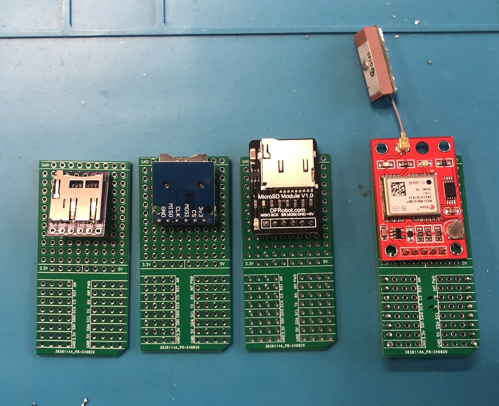

# Mikrobus Protoboard

https://www.mikroe.com/proto-click

> NB: `RX` pin is connected to `TX` pin of the socket and `TX` pin is connected to `RX` pin of the socket

## Usage
* [x] [OpenLog breakout](https://www.sparkfun.com/products/13712)
* [x] [Micro SD Card reader](https://www.adafruit.com/product/4682) + [RTC DS1307](https://www.adafruit.com/product/3296)
* [x] UBloc NEO6 Chinese module

