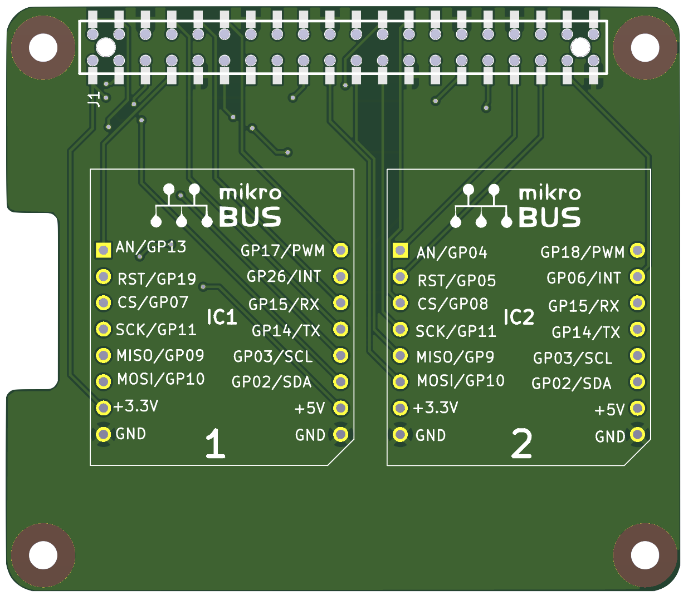

# Two-slots Mikrobus hat for Raspberry Pi

* https://github.com/devbisme/RPi_Hat_Template
* https://www.mikroe.com/pi-3-click-shield
* https://www.mikroe.com/pi-2-click-shield

## TODO
* [x] fix serigraphy for GPIOs
* [ ] add label and RPI logo in serigraphy
* [ ] add 4 Grove connectors for 1 UART, 1 GPIO and 2 I2C
* [ ] add selector for 3V3 or 5V0 on Grove connectors

