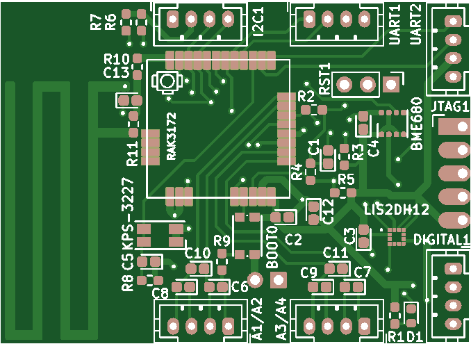
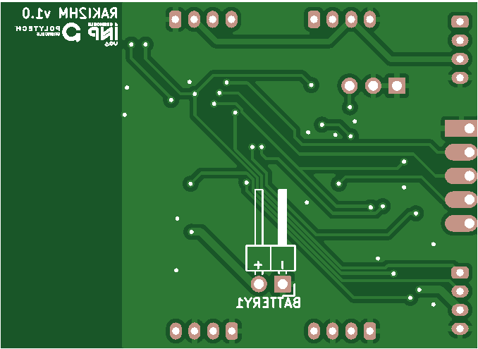

# I2HM Microclimate Station :: Board (RAK3172 version)

 

## HOW TO INSTALL

Clone this repository.

Open the KiCad project using KiCad 7 and above.

If necessary import the symbol and footprint libraries in the project.
