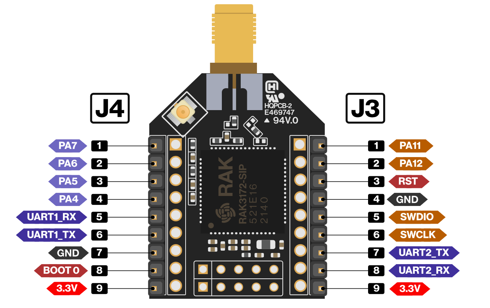
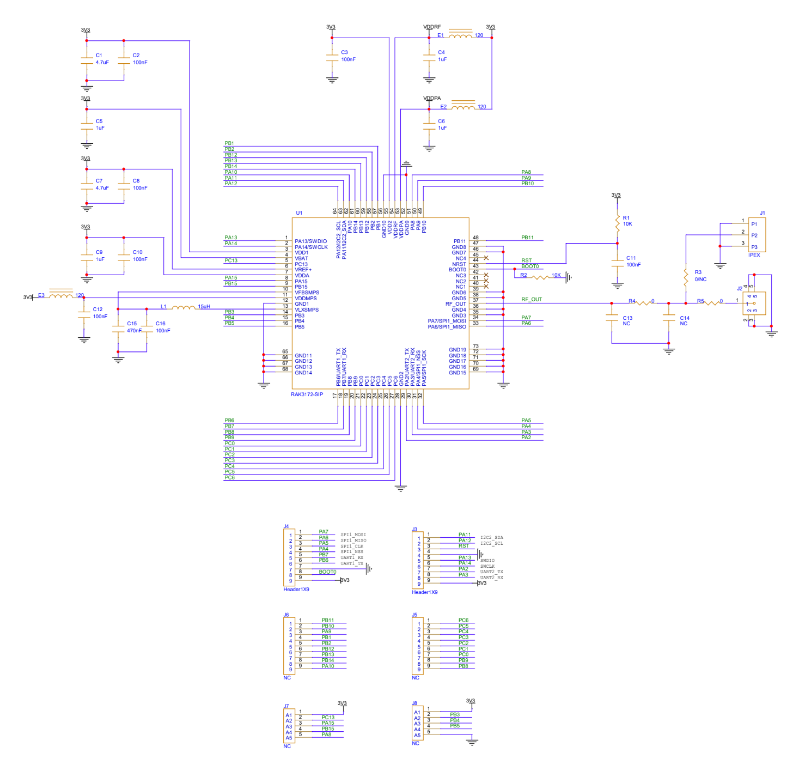
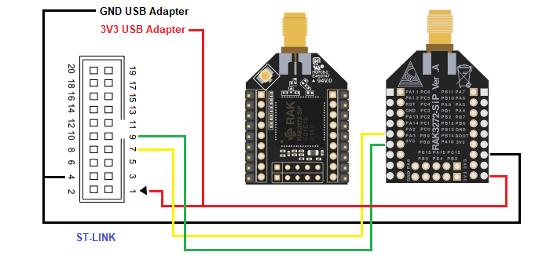

# Firmwares for RAK Wireless RAK3172 modules

* [Arduino](arduino)
* [RIOT OS](riot)
* [STM32Cube](stm32cube)

## References

- [RAK3172 stamp module](https://docs.rakwireless.com/Product-Categories/WisDuo/RAK3172-Module/Overview/)
- [RAK3272S breakout board](https://docs.rakwireless.com/Product-Categories/WisDuo/RAK3272S-Breakout-Board/Overview/)
- [RAK3172 evaluation board](https://docs.rakwireless.com/Product-Categories/WisDuo/RAK3172-Evaluation-Board/Overview/)
- [RAK3172-SiP chip](https://docs.rakwireless.com/Product-Categories/WisDuo/RAK3172-SiP/Overview/)
- [RAK3272-SiP breakout board](https://docs.rakwireless.com/Product-Categories/WisDuo/RAK3272-SiP-Breakout-Board/Overview/)

* https://docs.rakwireless.com/RUI3/#overview
* https://github.com/RAKWireless/RUI3-Best-Practice/blob/main/Tips-n-Tricks.md#lorawan-example
* https://docs.rakwireless.com/Product-Categories/WisDuo/RAK3172-SiP/Overview/#product-features
* https://docs.rakwireless.com/Product-Categories/WisDuo/RAK3272-SiP-Breakout-Board/Overview/
* https://docs.rakwireless.com/Product-Categories/WisDuo/RAK3272-SiP-Breakout-Board/Datasheet/#software

